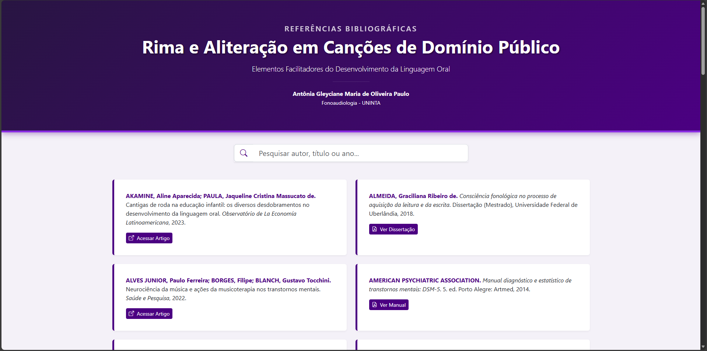

<p align="center">
  
</p>

Referencia-TCC
Este repositório armazena o código-fonte de um projeto web front-end desenvolvido como parte ou referência para um Trabalho de Conclusão de Curso (TCC). A estrutura do projeto é voltada para a criação de uma interface estática, servindo provavelmente como uma landing page informativa ou um protótipo visual para apresentação acadêmica.

Tecnologias Utilizadas

O projeto foi construído utilizando apenas tecnologias web básicas:

* **HTML5** (Estrutura e semântica)
* **CSS3** (Estilização e layout)

Como Executar:

Por ser um projeto front-end estático, não é necessária nenhuma instalação.

1.  Clone este repositório:
    ```bash
    git clone https://brnz4n.github.io/Referencia-TCC/
    ```
2.  Abra o arquivo `index.html` no seu navegador de preferência.

Autor:

* **[brnz4n](https://github.com/brnz4n)**
